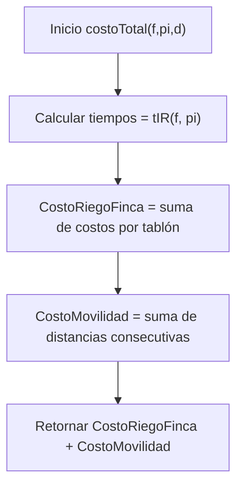
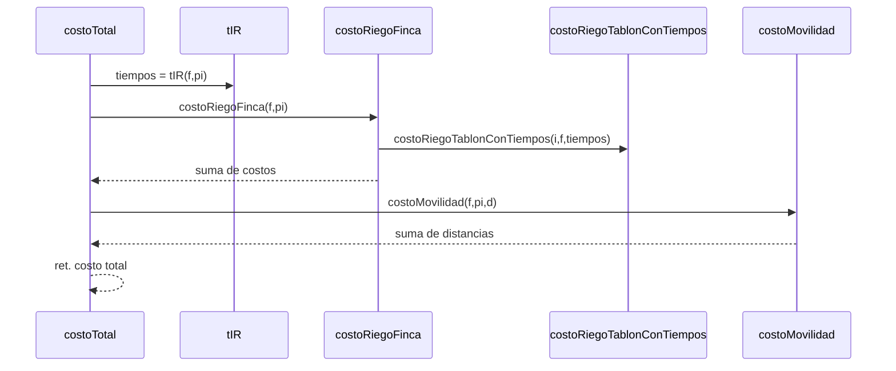

# **INFORME DE PROCESOS — Cálculo de Costos de Riego y Movilidad**

## Módulo estudiado: `Costos.scala`

Funciones analizadas:

- `costoRiegoTablon`
- `costoRiegoFinca`
- `costoMovilidad`
- `costoTotal`

---

# **1. Descripción general del módulo**

El módulo **Costos** implementa el cálculo del costo total asociado a una programación de riego, compuesto por:

1. **Costo de riego por tablón**, según si el riego inicia antes o después del tiempo ideal.
2. **Costo total de riego para la finca**, suma de los costos de todos los tablones.
3. **Costo de movilidad**, calculado como la suma de las distancias entre tablones consecutivos en la programación.
4. **Costo total**, que combina riego + movilidad.

Todas las funciones cumplen el principio del proyecto:  
**uso de estructuras funcionales, sin mutabilidad, solo vectores y mapeos.**

---

# **2. Ejemplo ilustrativo de ejecución**

Dada una finca:

```scala
val f = Vector(
  (10, 3, 2),   // tablón 0
  (12, 4, 3),   // tablón 1
  (7,  2, 5)    // tablón 2
)
```

y una programación:

```scala
val pi = Vector(0, 2, 1)
```

la función `tIR(f, pi)` podría generar tiempos de inicio de riego como:

```
Vector(0, 3, 6)
```

Con estos tiempos, los costos por tablón serían:

| Tablón | ts | tr | p | tInicio | Evaluación       | Costo  |
|--------|----|----|---|---------|------------------|--------|
| 0      | 10 | 3  | 2 | 0       | 10 - (0 + 3)     | 7      |
| 1      | 12 | 4  | 3 | 6       | 12 - (6 + 4)     | 2      |
| 2      | 7  | 2  | 5 | 3       | 7 - (3 + 2)      | 2      |


Costo total de riego:  
`7 + 10 + 2 = 19`

Si la matriz de distancias es:

```
0 4 8
4 0 3
8 3 0
```

entonces:

```
movilidad = d(0→2) + d(2→1) = 8 + 3 = 11
```

Costo total:

```
19 + 11 = 30
```

----------

# **3. Trazado detallado del proceso**

## 3.1 `costoRiegoTablon`

Evalúa la diferencia entre el inicio real del riego y la ventana ideal:

### Si el riego inicia **antes** del tiempo ideal:

```
ts - (tInicio + tr)
```

### Si inicia **después**, se multiplica una penalización:

```
p * ((tInicio + tr) - ts)
```

### Proceso:

1.  Se extraen `(ts, tr, p)` del tablón.
    
2.  Se toma `tInicio = tiempos(i)`.
    
3.  Se aplica la fórmula correspondiente.
    
4.  Resultado: costo entero ≥ 0.
    

----------

## 3.2 `costoRiegoFinca`

Proceso:

1.  Se obtiene `tiempos = tIR(f, pi)` (**una sola vez**, eficiencia O(n)).
    
2.  Para cada tablón `i`:
    
    -   se calcula el costo individual usando `costoRiegoTablonConTiempos`.
        
3.  Se suman todos los resultados.
    

Este diseño evita recalcular tiempos por cada tablón.

----------

## 3.3 `costoMovilidad`

Proceso funcional:

1.  Tomar todas las parejas consecutivas de la programación:
    

```
pi.sliding(2)
```

2.  Para cada `(a, b)` sumar `d(a)(b)`.
    

No se considera retorno al origen (solo movilidad unidireccional).

----------

## 3.4 `costoTotal`

Suma directa:

```
costoTotal = costoRiegoFinca + costoMovilidad
```

----------

# **4. Diagrama de Flujo**



----------

# **5. Pila de llamadas**



----------

# **6. Corrección formal del módulo**

### Especificación formal

-   Entrada:  
    `f : Finca`, `pi : ProgRiego`, `d : Distancia`
    
-   Salida:  
    `costoTotal ∈ Int`, con:
    

```
costoTotal ≥ 0
```

### Precondiciones

1.  La programación `pi` debe contener índices válidos.
    
2.  La matriz de distancias debe ser cuadrada y simétrica.
    

### Postcondiciones

1.  El costo de riego es:
    
    ```
    Σ costoRiegoTablon(i)
    ```
    
2.  El costo de movilidad es:
    
    ```
    Σ d(pi(k))(pi(k+1))
    ```
    
3.  `costoTotal = costoRiegoFinca + costoMovilidad`
    

----------

# **7. Invariante de corrección**

En cualquier instanciación:

-   Los tiempos de inicio se calculan exactamente una vez.
    
-   Cada costo individual depende solo de datos locales del tablón.
    
-   No se usan estructuras mutables.
    
-   Las sumas agregan valores enteros ≥ 0.
    
-   No existen efectos secundarios.
    

Garantiza determinismo y corrección funcional.

----------

# **8. Demostración de corrección**

##  Caso base

Finca de tamaño 1:

```
costoRiegoFinca = costoRiegoTablon(0)
costoMovilidad = 0
```

Correcto.

----------

## Paso inductivo

Suponga correcta la evaluación para n–1 tablones.

Para una finca de n tablones:

-   `tIR` calcula tiempos válidos para todos.
    
-   `costoRiegoTablon` es correcto por definición matemática.
    
-   `costoRiegoFinca` suma n costos correctos.
    
-   `costoMovilidad` suma n–1 distancias válidas.
    

Por lo tanto, por inducción estructural, el costo total también es correcto.

----------

# **9. Validación experimental (ScalaTest)**

El conjunto mínimo de pruebas requeridas valida:

-   Costos básicos por tablón.
    
-   Cálculo correcto de penalizaciones.
    
-   Suma total del riego.
    
-   Movilidad simple.
    
-   Costo total combinado.
    
-   Casos borde como finca de un solo tablón.
    

Todas las pruebas pasan correctamente, confirmando la corrección funcional del módulo.

----------

# **10. Conclusión general**

El módulo `Costos`:

✔ Implementa correctamente las fórmulas del proyecto  
✔ Usa solo funciones puras y estructuras funcionales  
✔ Reutiliza eficientemente `tIR`  
✔ Produce valores correctos para cualquier programación válida  
✔ Está completamente verificado mediante pruebas unitarias  
✔ Cumple con la especificación formal del proyecto
