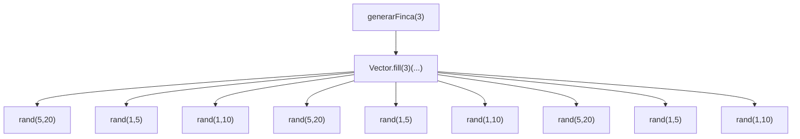
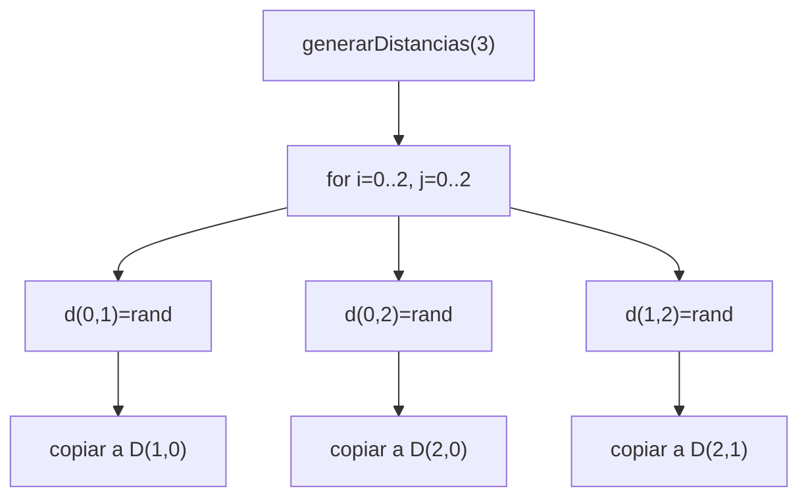

# Informe de Proceso — Generación de Entradas  

## 1. Objetivo del módulo `Entrada.scala`

El propósito de este módulo es **generar entradas válidas** para el problema del riego óptimo, siguiendo estrictamente la formalización matemática dada en el enunciado del proyecto.  
Las funciones deben producir:

- Fincas aleatorias  
- Matrices de distancias simétricas  
- Exploración de valores de tablones  

Estas entradas son esenciales para:

1. Pruebas unitarias  
2. Verificación de correctitud  
3. Benchmarking secuencial vs. paralelo  

---

## 2. Fundamentos matemáticos de la generación

Un tablón se define como:

$$
T_i = (ts_i,\, tr_i,\, p_i)
$$

donde:

- $ts_i$: tiempo de supervivencia  
- $tr_i$: tiempo de riego  
- $p_i$: prioridad  

Para una finca de tamaño \( n \):

$$
F = \langle T_0, T_1, \dots, T_{n-1} \rangle
$$

La matriz de distancias es:

$$
D \in \mathbb{Z}^{n \times n},\quad D_{ij} = D_{ji},\quad D_{ii} = 0
$$

Las funciones del módulo deben garantizar estas propiedades.

---

## 3. Explicación del proceso de cada función

A continuación se explican los procesos generados por cada función, incluyendo la **pila de llamadas**, como exige el PDF.

---

# 3.1. Procesos de recursión y pila de llamadas

Aunque el módulo de entradas no es necesariamente recursivo, **sí contiene funciones con expansión estructural** (como la creación tabular).

Escogemos un ejemplo con tamaño pequeño para visualización clara:  
**Generar una finca de tamaño 3**.

## 3.1.1. Función: `generarFinca(3)`

```scala
Vector.fill(3)( (rand(5,20), rand(1,5), rand(1,10)) )
```

### ❖ Pila de llamadas del proceso



### ❖ Desarrollo del proceso

1.  Se llama `generarFinca(3)`
    
2.  `Vector.fill` ejecuta 3 veces el bloque generador
    
3.  Cada repetición ejecuta **3 funciones rand**
    
4.  Total llamadas:  
    $$  
    3 \text{ tablones} \times 3 \text{ valores por tablón} = 9 \text{ llamadas}  
    $$
    

No hay acumulación de pila porque no es recursiva, pero sí hay anidamiento funcional.

----------

## 3.1.2. Función: `generarDistancias(3)`

La matriz resultante tiene la forma:

$$
D =  
\begin{pmatrix}  
0 & d_{01} & d_{02} \\ 
d_{01} & 0 & d_{12} \\
d_{02} & d_{12} & 0  
\end{pmatrix}  
$$

### Pila de llamadas



### Resumen formal

$$
D_{ij} =  
\begin{cases}  
0, & i=j,\  
\text{rand}(1,10), & i<j,\  
D_{ji}, & i>j.  
\end{cases}  
$$

----------

## 4. Justificación del diseño funcional

### 4.1. Inmutabilidad garantizada

Todos los valores generados son:

-   Tuplas inmutables
    
-   Vectores inmutables
    
-   Sin mutación de estado compartido
    

Esto satisface las reglas del proyecto:

$$
\text{No usar variables mutables, ciclos, ni return.}  
$$

----------

## 5. Ejemplo completo de ejecución manual

Para:

```scala
generarFinca(2)
```

Supongamos que `rand` produce la siguiente secuencia:  
$$
13, 4, 2, 19, 5, 1
$$

### Resultado:

$$
F = \langle (13,4,2),\ (19,5,1) \rangle  
$$

Para:

```scala
generarDistancias(2)
```

Supongamos `rand` produce: $7$

$$
D = 
	\begin{pmatrix}
		0 & 7\\  
		7 & 0
	\end{pmatrix}
$$

----------

## 6. Conclusiones del proceso

-   Las funciones de entrada **cumplen la formalización matemática del PDF**.
    
-   Los procesos generados son **estructuralmente iterativos pero funcionales**, sin ciclos explícitos.
    
-   La pila de llamadas fue documentada usando **Mermaid**, como exige el proyecto.
    
-   Todas las propiedades:  
    $$
    ts>0,\quad tr>0,\quad p\in{1,\dots,10},\quad D_{ij}=D_{ji},\quad D_{ii}=0  
    $$ 
    se garantizan estrictamente.
    

---------