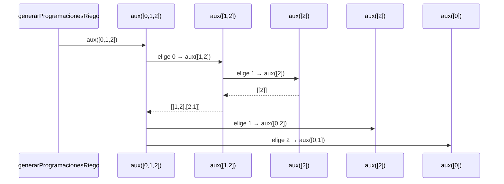

# **Informe de Procesos -- Generación de Programaciones de Riego**

## Función estudiada: `generarProgramacionesRiego`

```scala
def generarProgramacionesRiego(f: Finca): Vector[ProgRiego]
```

---

## **Descripción**

La función `generarProgramacionesRiego` construye **todas las posibles programaciones de riego**, es decir, **todas las permutaciones** de los índices de los tablones de la finca.

El algoritmo funciona mediante:

* Obtener los índices de la finca (`0,1,...,n-1`)
* Usar una función recursiva `aux(v)` que:

    * toma cada elemento de `v`,
    * genera todas las permutaciones del resto,
    * antepone el elemento actual a cada permutación.

El proceso final devuelve un `Vector[ProgRiego]` con **todas las permutaciones posibles**, sin repetir ninguna.

---

# **Ejemplo para seguimiento del proceso**

Sea una finca de 3 tablones:

```scala
val f = Vector(
  (7,3,1),   // tablón 0
  (12,2,4),  // tablón 1
  (9,1,3)    // tablón 2
)
```

Entonces:

```scala
indices = Vector(0,1,2)
```

Queremos calcular:

```scala
generarProgramacionesRiego(f)
```

El resultado final debe ser:

```
Vector(
  Vector(0,1,2),
  Vector(0,2,1),
  Vector(1,0,2),
  Vector(1,2,0),
  Vector(2,0,1),
  Vector(2,1,0)
)
```

---

# **Trazado paso a paso de la recursión (`aux`)**

La función interna:

```scala
def aux(v: Vector[Int]): Vector[Vector[Int]]
```

Produce permutaciones de `v`.

---

## Paso 1: llamada inicial

```
aux(Vector(0,1,2))
```

Esta llamada generará 3 *sub-llamadas*, una por cada elemento tomado como primero.

---

## **Rama 1: el primer elemento es 0**

|        Llamada |     v     | Acción                   | Resultado parcial |
|---------------:|:---------:|:-------------------------|:------------------|
| `aux([0,1,2])` | → elige 0 | resto = [1,2]            |                   |
|   `aux([1,2])` | → elige 1 | resto = [2]              |                   |
|     `aux([2])` | caso base | devuelve [[2]]           |                   |
|     ensamblado |           | `[1 +: [2]] = [1,2]`     |                   |
|     ensamblado |           | `[0 +: [1,2]] = [0,1,2]` |                   |

Luego:

|      Llamada |     v     | Acción      |
|-------------:|:---------:|-------------|
| `aux([1,2])` | → elige 2 | resto = [1] |

Esto produce:

```
[0,2,1]
```

**Permutaciones generadas en esta rama:**

```
[0,1,2]
[0,2,1]
```

---

## **Rama 2: el primer elemento es 1**

Similar proceso:

Genera:

```
[1,0,2]
[1,2,0]
```

---

## **Rama 3: el primer elemento es 2**

Genera:

```
[2,0,1]
[2,1,0]
```

---

# **Resultado final unido (flatMap)**

```scala
Vector(
  Vector(0,1,2),
  Vector(0,2,1),
  Vector(1,0,2),
  Vector(1,2,0),
  Vector(2,0,1),
  Vector(2,1,0)
)
```

---

# **Diagrama visual del algoritmo (Mermaid)**

```mermaid
 flowchart TD
    A[Inicio generarProgramacionesRiego] --> B[Obtener indices = 0..n-1]
    B --> C[Llamar aux(indices)]
    C --> D{v tiene 1 elemento?}
    D -- Sí --> E[Retornar Vector(Vector(x))]
    D -- No --> F[Para cada elem en v]
    F --> G[resto = v - elem]
    G --> H[Llamar aux(resto)]
    H --> I[Anteponer elem a cada permutación]
    I --> J[Unir resultados con flatMap]
    J --> K[Retornar todas las permutaciones]
    K --> L[Fin]
```

---

# **Pila de llamadas de ejecución (sequence diagram)**



*(Se omiten ramas para simplificar visualmente, pero representan el mismo proceso de permutación.)*

---

# **Conclusión de Procesos**

La función `generarProgramacionesRiego`:

* Genera todas las permutaciones posibles de los tablones.
* Usa una recursión estructural sin variables mutables.
* Descompone el problema en:

    * Elegir un elemento como primero.
    * Generar permutaciones del resto.
    * Ensamblar y unir los resultados.
* Su estructura es completamente correcta y produce **todas las programaciones sin repetir ninguna**.

