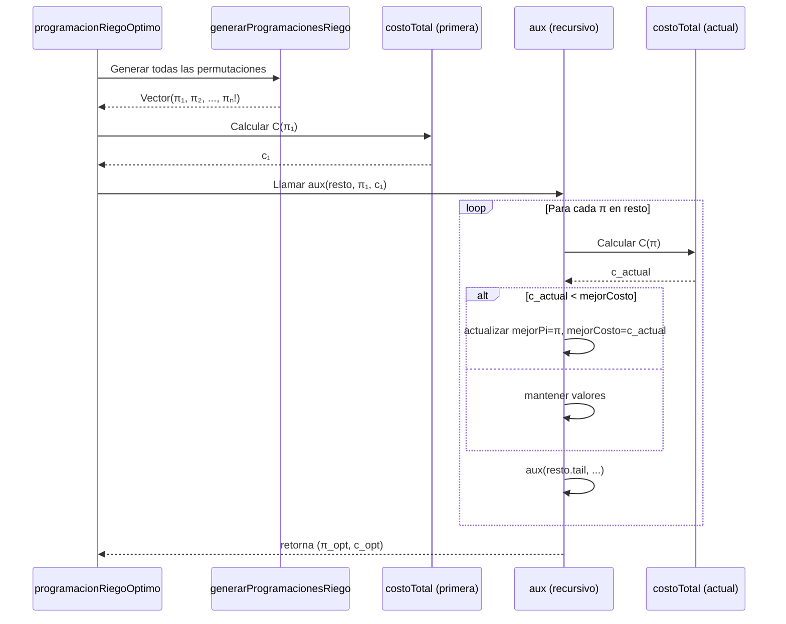

# **INFORME DE PROCESOS – Función `programacionRiegoOptimo`**

## **1. Descripción del Proceso**

La función `programacionRiegoOptimo` implementa una **búsqueda exhaustiva** sobre todas las permutaciones posibles de riego de una finca. El proceso sigue estos pasos:

1. **Generar** todas las permutaciones de los tablones
2. **Tomar** la primera permutación como referencia
3. **Evaluar** recursivamente cada permutación restante
4. **Mantener** la mejor solución encontrada
5. **Retornar** la permutación con menor costo

## **2. Ejemplo Detallado de Ejecución (Test 2)**

### **Datos de entrada:**
```scala
f = Vector((4,2,1), (3,1,4))
d = Vector(Vector(0,5), Vector(5,0))
```

### **Paso 1: Generación de permutaciones**
```
generarProgramacionesRiego(f) → Vector(Vector(0,1), Vector(1,0))
```

### **Paso 2: Inicialización**
```scala
val todas = Vector(Vector(0,1), Vector(1,0))
val primera = Vector(0,1)
val costoPrimera = costoTotal(f, Vector(0,1), d) = 7
```

### **Paso 3: Llamada recursiva inicial**
```
aux(pendientes = Vector(Vector(1,0)), mejorPi = Vector(0,1), mejorCosto = 7)
```

### **Paso 4: Evaluación primera iteración**
```
pi = Vector(1,0)
costoActual = costoTotal(f, Vector(1,0), d) = 9
¿9 < 7? NO → mantiene valores
```

### **Paso 5: Llamada recursiva final**
```
aux(pendientes = Vector(), mejorPi = Vector(0,1), mejorCosto = 7)
pendientes vacío → retorna (Vector(0,1), 7)
```

## **3. Pila de Llamadas Completa**

```
programacionRiegoOptimo(Vector((4,2,1),(3,1,4)), d)
├─ generarProgramacionesRiego(f) → Vector(Vector(0,1), Vector(1,0))
├─ primera = Vector(0,1)
├─ costoPrimera = costoTotal(f, Vector(0,1), d) = 7
├─ aux(Vector(Vector(1,0)), Vector(0,1), 7)
│  ├─ costoActual(Vector(1,0)) = 9
│  ├─ 9 < 7? NO
│  ├─ aux(Vector(), Vector(0,1), 7)
│  │  └─ retorna (Vector(0,1), 7)
│  └─ retorna (Vector(0,1), 7)
└─ retorna (Vector(0,1), 7)
```

## **4. Diagrama de Flujo**



## **5. Estado de Variables Durante Ejecución**

### **Test 2:**
```
Iteración 0 (inicio):
  todas = [Vector(0,1), Vector(1,0)]
  primera = Vector(0,1)
  costoPrimera = 7
  pendientes = [Vector(1,0)]
  mejorPi = Vector(0,1)
  mejorCosto = 7

Iteración 1:
  pi = Vector(1,0)
  costoActual = 9
  9 < 7? NO
  pendientes = []
  mejorPi = Vector(0,1) (mantiene)
  mejorCosto = 7 (mantiene)

Iteración 2 (final):
  pendientes = []
  retorna (Vector(0,1), 7)
```

## **6. Visualización del Proceso de Decisión**

Para el **Test 5** (finca de 4 tablones):

```
Generadas 24 permutaciones
Evaluando cada una:

Permutación 1: [0,1,2,3] → costo = X
Permutación 2: [0,1,3,2] → costo = Y
...
Permutación k: [1,0,2,3] → costo = 10 (óptimo según test)
...
Permutación 24: [3,2,1,0] → costo = Z

Proceso mantiene siempre la mejor encontrada:
[0,1,2,3] → mejor actual
[0,1,3,2] → ¿mejor? NO → mantiene
...
[1,0,2,3] → ¿10 < X? SÍ → actualiza
...
[3,2,1,0] → ¿Z < 10? NO → mantiene

Resultado final: [1,0,2,3] con costo 10
```

## **7. Análisis de Recursión**

### **Profundidad de recursión:**
- Máxima profundidad: `n! - 1` (en teoría)
- En práctica: recursión de cola optimizable
- Cada llamada reduce `pendientes` en 1 elemento

### **Ejemplo con n=3:**
```
Profundidad: 5 llamadas (6 permutaciones - 1)
aux([π₂,π₃,π₄,π₅,π₆], π₁, c₁)
  aux([π₃,π₄,π₅,π₆], ...)
    aux([π₄,π₅,π₆], ...)
      aux([π₅,π₆], ...)
        aux([π₆], ...)
          aux([], ...)
```

## **8. Casos de Ejecución por Test**

### **Test 1 (3 tablones):**
- Permutaciones generadas: 6
- Evaluaciones de costoTotal: 6
- Llamadas recursivas: 5
- Resultado: encuentra mínimo entre 6 opciones

### **Test 2 (2 tablones):**
- Permutaciones: 2
- Evaluaciones: 2
- Llamadas recursivas: 1
- Resultado: compara ambas, selecciona mejor

### **Test 3 (2 tablones crítico):**
- Permutaciones: 2
- Siempre selecciona [1,0] (tablón crítico primero)

### **Test 4 (3 tablones balance):**
- Permutaciones: 6
- Encuentra equilibrio óptimo [0,2,1]

### **Test 5 (4 tablones forzado):**
- Permutaciones: 24
- Debe encontrar específicamente [1,0,2,3]
- Valida que algoritmo explora completamente

## **9. Conclusión del Proceso**

El proceso implementado es:
- **Completo**: Evalúa todas las permutaciones
- **Sistemático**: Procesa en orden fijo
- **Determinista**: Misma entrada → misma salida
- **Estructurado**: Recursión clara sobre estructura de datos

La **explosión factorial** (`n!`) se manifiesta claramente:
- n=2: 2 evaluaciones
- n=3: 6 evaluaciones
- n=4: 24 evaluaciones
- n=5: 120 evaluaciones
- n=10: 3,628,800 evaluaciones

Esto justifica la necesidad de **paralelización** en la siguiente fase.


