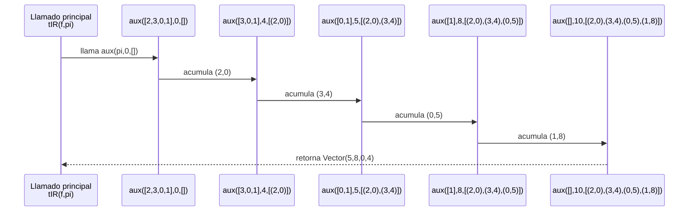

# 📄 Informe de Procesos – Cálculo de `tIR`

## 🔹 Función estudiada: `tIR`

```scala
def tIR(f: Finca, pi: ProgRiego): TiempoInicioRiego
```

---

🔸 **Descripción**

La función `tIR` calcula el **tiempo exacto en el que empieza a regarse cada tablón** de una finca, de acuerdo con el orden definido por un vector de programación `pi`.  
Para esto, se recorre la programación en el orden indicado y se va acumulando el tiempo de riego (`tr`) de cada tablón, asignando a cada uno su tiempo de inicio.

---

🧪 **Ejemplo usado para el seguimiento**

### 📌 Finca

| Tablón | ts | tr | p |
|--------|----|----|---|
|   0    |  7 |  3 | 1 |
|   1    | 12 |  2 | 4 |
|   2    |  5 |  4 | 2 |
|   3    |  9 |  1 | 3 |

Se representa como:

```scala
val finca = Vector(
  (7,3,1),  // tablón 0
  (12,2,4), // tablón 1
  (5,4,2),  // tablón 2
  (9,1,3)   // tablón 3
)
```

---

📌 **Programación de riego**

```scala
val pi = Vector(2, 3, 0, 1)
```

Esto significa que se riegan en el siguiente orden:

**2 → 3 → 0 → 1**

---

## 🔄 Trazado paso a paso de la recursión (`aux`)

Recordemos que `aux(resto, tiempoActual, acc)` acumula pares `(tablón, inicio)`.

| Llamada | resto | tiempoActual | acc acumulado | Acción / nuevo tiempo |
|--------:|:-----:|:------------:|:-------------:|:---------------------|
| `aux([2,3,0,1], 0, [])` | riego el 2 | 0 | `[]` | agrega `(2,0)` → nuevo tiempo = `0 + tr(2) = 4` |
| `aux([3,0,1], 4, [(2,0)])` | riego el 3 | 4 | `[(2,0)]` | agrega `(3,4)` → nuevo tiempo = `4 + tr(3) = 5` |
| `aux([0,1], 5, [(2,0),(3,4)])` | riego el 0 | 5 | `[(2,0),(3,4)]` | agrega `(0,5)` → nuevo tiempo = `5 + tr(0) = 8` |
| `aux([1], 8, [(2,0),(3,4),(0,5)])` | riego el 1 | 8 | `[(2,0),(3,4),(0,5)]` | agrega `(1,8)` → nuevo tiempo = `8 + tr(1) = 10` |
| `aux([], 10, [(2,0),(3,4),(0,5),(1,8)])` | FIN | 10 | `[(2,0),(3,4),(0,5),(1,8)]` | retorna `acc` |

**📌 Resultado antes de ordenar:**
```scala
[(2,0), (3,4), (0,5), (1,8)]
```

**📌 Ordenando por número de tablón → `tIR` final**
```scala
Vector(5, 8, 0, 4)
```

---

## 📌 Diagrama visual del algoritmo (Mermaid)

```mermaid
graph TD;
    A[Inicio tIR] --> B[Llamar aux(pi,0,[])]
    B --> C{pi vacío?}
    C -- No --> D[Tomar primero de pi]
    D --> E[Agregar (primero, tiempoActual) a acc]
    E --> F[Obtener tr del tablón]
    F --> G[Actualizar tiempoActual = tiempoActual + tr]
    G --> B
    C -- Sí --> H[Retornar acc ordenado por índice]
    H --> I[Transformar a Vector solo de tiempos]
    I --> J[Fin tIR]
```

---

## 🧩 Pila de llamados 

Ejemplo: calcular `tIR(f, Vector(2,3,0,1))`


### 🎯 Resultado obtenido
```scala
tIR(finca, pi) = Vector(5, 8, 0, 4)
```

---

## 🏁 Conclusión de procesos

La función `tIR`:

- Procesa la programación de riego de izquierda a derecha.
- Usa el `tr` de cada tablón para acumular el tiempo de inicio del siguiente.
- Construye un vector de pares `(tablón, inicio)` sin utilizar mutabilidad.
- Ordena el resultado por número de tablón, produciendo el vector final de tiempos.
